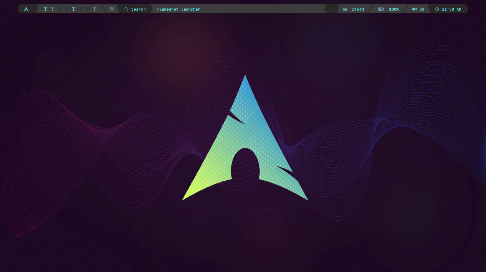

# LazyWal - Arch Linux Ricing Setup Script

---

<p align="center">
  
</p>

<p align="center">
  
  <br>
  
  
</p>

> **Automated installer & theme manager for Arch-based systems.**
> Minimal and efficient

---

## Table of Contents

- [About LazyWal](#about-lazywal)
- [Features](#features)
- [Requirements](#requirements)
- [Installation](#installation)
- [Usage](#usage)
- [Screenshots](#screenshots)
- [FAQ](#faq)
- [Contributing](#contributing)
- [License](#license)

---

## About LazyWal

**LazyWal** is a shell script to automate the installation and configuration of a personalized ricing environment on Arch Linux.
It integrates **Pywal**, **wpgtk**, **Qtile**, **Zsh**, and many more tools to provide a cohesive visual and functional experience.

The goal is to simplify the process of setting up a beautiful and productive desktop, while keeping it modular and easy to customize.

---

## Features

- Automatic installation of AUR helper (`paru`).
- Configures Qtile, Dunst, Rofi, Alacritty, etc.
- Installs Oh My Zsh, Powerlevel10k, plugins.
- Applies pywal themes & gtk themes.
- Fonts, Picom (jonaburg fork), and utilities setup.
- GPU driver detection & suggestion.
- Optional Spotify theming script.
- Modular structure for easy customization.

---

## Requirements

LazyWal has very few requirements. The script handles almost everything for you — from package installation to configuration.

Before running LazyWal, make sure you have:

- A working Arch Linux installation, freshly booted into your system.
  You don't need a graphical environment — just a functional terminal is enough.
  As long as you've done the basic setup (bootloader, base packages, network access, etc.), you're ready.
- A non-root user with sudo privileges.  
  The script must be executed as your user, **not as root**.
- An audio server installed (e.g., **PulseAudio**, **PipeWire**).  
  By default, LazyWal expects **PulseAudio**, but you're free to use another one.
  Just note that some scripts might need minor adjustments if you change the default.
- The repository must be cloned using `git clone`, **not downloaded as a ZIP file**, to preserve proper file permissions.
- Run the script from the **root of the cloned repository** (where the main script is located).

> **Note:** If you've made it through a basic Arch install and you're back at the terminal, you're already 90% there. LazyWal takes care of the rest.


---

## Installation

### Clone the repository
```bash
git clone https://github.com/RockdrigoTC/LazyWal.git
cd LazyWal
./lazywal-setup.sh
```
