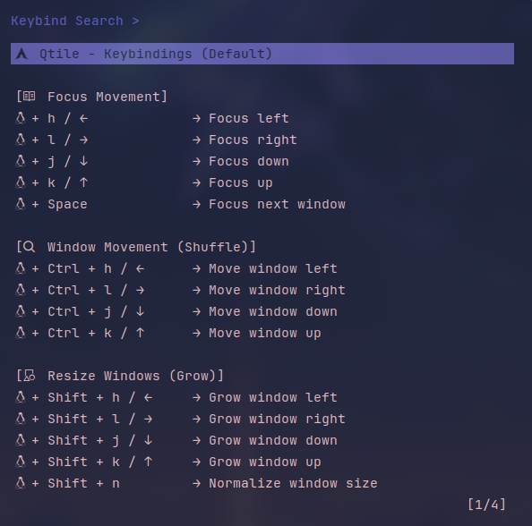
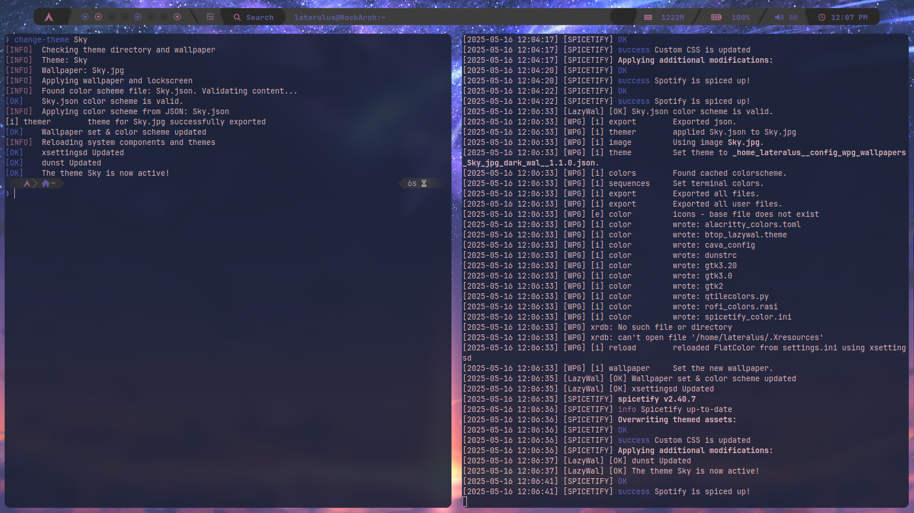

# LazyWal - Arch Linux Ricing Setup Script

---


---

> **A simple installer & theme manager for Arch-based systems.**  
> Minimalist, practical, and focused on giving you a clean riced setup
> without the hassle.

---

## Table of Contents

- [About LazyWal](#about-lazywal)
- [Features](#features)
- [Requirements](#requirements)
- [Installation](#installation)
- [Post-Installation](#post-installation)
- [Usage](#usage)
  - [Keybindings](#keybindings)
    - [Keybindings interface](#keybindings-interface)
  - [Changing themes](#changing-themes)
  - [Adding Themes](#adding-themes)
  - [Configuring Themes](#configuring-themes)
    - [JSON Configuration](#json-configuration)
    - [Editing Colorschemes with wpgtk](#editing-colorschemes-with-wpgtk)
- [FAQ](#faq)
- [Contributing](#contributing)
- [Credits](#credits)

---

## About LazyWal

**LazyWal** is a shell script designed to simplify the setup of a personalized
ricing environment on Arch Linux.
It brings together tools like **Pywal**, **wpgtk**, **Qtile**, **Zsh**,
and others to create a cohesive visual and functional desktop.

The goal is to make the process of configuring a clean, beautiful,
and productive environment less tedious,  
while keeping everything modular and easy to tweak to your liking.

---

## Features

- Automatic installation of AUR helper (`paru`).
- Configures Qtile, Dunst, Rofi, Alacritty, etc.
- Installs Oh My Zsh, Powerlevel10k, plugins.
- Applies pywal themes & gtk themes.
- Fonts, Picom (jonaburg fork), and utilities setup.
- GPU driver detection & suggestion.
- Optional Spotify theming script.
- Modular structure for easy customization.

---

## Requirements

LazyWal has very few requirements. The script handles almost everything for you
from package installation to configuration.

Before running LazyWal, make sure you have:

- A working Arch Linux installation, freshly booted into your system. You don't
  need a graphical environment — just a functional terminal is enough. As long
  as you've done the basic setup (bootloader, base packages, network access,
  etc.), you're ready.
- A non-root user with sudo privileges. The script must be executed as your
  user, **not as root**.
- An audio server installed (e.g., **PulseAudio**, **PipeWire**). By default,
  LazyWal expects **PulseAudio**, but you're free to use another one. Just note
  that some scripts might need minor adjustments if you change the default.
- The repository must be cloned using `git clone`, **not downloaded as a ZIP
  file**, to preserve proper file permissions.
- Run the script from the **root of the cloned repository** (where the main
  script is located).

> **Note:** If you've made it through a basic Arch install and you're back at
> the terminal, you're already 90% there. LazyWal takes care of the rest.

---

## Installation

### Clone the repository

```bash
git clone https://github.com/RockdrigoTC/LazyWal.git
cd LazyWal
./lazywal-setup.sh
```

Any errors during the installation will be logged in `~/.cache/lazywal/lazywal.log`.

## Post-Installation

Once you have installed the system, you can run the following script from
the terminal: `spotify-setup.sh`. Spotify will be integrated into the system
after the script has been executed.

---

## Usage

### Keybindings

LazyWal comes with a set of predefined keybindings to enhance productivity and
ease of use. You can view the list of available keybindings in an interactive
interface by pressing **Windows + o**. This will display a searchable menu where
all default shortcuts are listed for quick reference.

This feature helps you learn and explore the available keybindings without having
to dig through configuration files.

#### keybindings interface



### Changing themes

You can change themes in two different ways:

1. Using the terminal  
   Run the following command to change the current theme:
   change-theme "theme-name"
   The theme name must exist in your configured themes.
   For more details, check the [Adding Themes](#adding-themes) section.

2. Using a keyboard shortcut  
    Press **Windows + i** to open a theme selector interface.
   This interface will display the available themes you have configured.
   Navigate through the list, select the desired theme, and press Enter.
   The system will apply the new theme and show a notification once the
   change is successful.

### Adding Themes

To add a new theme, you need to place it inside the `~/Themes` directory
(located in your home folder).

Each theme must have its own folder named after the theme.
For example: `~/Themes/Forest`, `~/Themes/Ocean`, etc.

Inside each theme folder, it's recommended to include an image preview of the
theme. The image file should have the **same name as the folder** and the proper
image extension (e.g., `.png`, `.jpg`).

Example folder structure:

```bash
Themes/
├── Forest/
│   ├── Forest.png
│   └── Forest.json
├── Ocean/
│   ├── Ocean.jpg
│   └── Ocean.json
```

### Configuring Themes

There are two ways to configure themes.:

#### JSON Configuration

Optionally, you can include a JSON file inside the theme folder to define custom
colors or other visual elements.

The JSON file must be named exactly like the theme folder.  
For example: `Forest.json`, `Ocean.json`.

Example of a JSON file:

```json
{
  "color1": "#1e1e2e",
  "color2": "#89b4fa",
  "color3": "#f38ba8",
  "color4": "#f9e2af",
  "color5": "#94e2d5",
  "color6": "#f5c2e7",
  "color7": "#f8bd96",
  "color8": "#cdd6f4",

  "color9": "#1e1e2e",
  "color10": "#89b4fa",
  "color11": "#f38ba8",
  "color12": "#f9e2af",
  "color13": "#94e2d5",
  "color14": "#f5c2e7",
  "color15": "#f8bd96"
}
```

#### Editing Colorschemes with wpgtk

You can also customize your theme colors using **wpgtk's graphical interface**.
This allows you to visually edit and fine-tune the colors of your current
colorscheme.

For more details on how to edit a colorscheme, refer to the wpgtk wiki:  
[Edit a Colorscheme (wpgtk wiki)](https://github.com/deviantfero/wpgtk/wiki/Colorschemes#edit-a-colorscheme)

> **Important:**  
> After editing a colorscheme, you need to reload the theme for the changes to
> take effect. You can do this by selecting the theme again via the terminal or
> through the graphical theme selector.  
> See [Changing Themes](#changing-themes).

### Viewing the LazyWal Log

If you ever need to check what LazyWal has been doing under the hood, you can
view the log file located at `~/.cache/lazywal/lazywal.log`

You can open this log with your favorite text editor,
but there's also a more _ricing-friendly_ way to do it directly from the terminal.

LazyWal includes some simple helper commands for log viewing:

- **logtail** → View the log in real time (like `tail -f`)
- **logless** → View the log with paging & searching (like `less`)
- **loggrep** → Search specific patterns inside the log (like `grep`)

These tools are named to be self-explanatory and focus on exactly what they do.
Their purpose is to make it easy to tail, view, or search through the LazyWal
log without needing to remember commands.

> **Recommended:**
> If you enjoy the aesthetic of text flying by in the terminal,
> this method will feel right at home.
> It’s fast, efficient, and honestly… it looks pretty cool.

#### Example of logtail in action:



---

## Contributing

If you want to help improve this project,
just follow these simple steps:

1. Fork the repo and create a branch off `main`.
2. Make your changes with clear, meaningful commit messages.
3. Test everything to make sure it works well.
4. Open a pull request explaining what you did and why.
5. Be respectful and follow the [Code of Conduct](https://www.contributor-covenant.org/version/2/0/code_of_conduct/).

Thanks a lot for helping make this project better!

---

## Credits

This project is strongly inspired by and builds upon ideas from the  
[Cozytile](https://github.com/Darkkal44/Cozytile) repository.  
While the focus and implementation here are different, Cozytile served as  
an important foundation and reference.

We also want to thank the talented artists whose images are used as examples  
within this environment. Their work greatly enhances the visual experience  
and is much appreciated.

---

## FAQ

**Q: What is LazyWal?**  
A: LazyWal is an automated installer and theme manager designed for Arch Linux  
and its derivatives, aimed at creating a cohesive and personalized desktop  
environment.

**Q: How do I change themes?**  
A: You can change themes either by running `change-theme <Theme name>` in the  
terminal or by using the keyboard shortcut `Windows + i` to open the graphical  
theme selector.

**Q: Where should I add new themes?**  
A: New themes should be added inside the `themes/` folder in your home directory.
Each theme should be a folder containing at least an image and optionally a JSON
file with color configurations.

**Q: Can I customize colors?**  
A: Yes, you can use wpgtk’s graphical interface to edit colorschemes visually.  
Remember to reload the theme after making changes to apply them.

**Q: What should I do if I encounter errors during installation?**  
A: Check the log file located at `~/.cache/lazywal/lazywal.log` for detailed  
error messages and troubleshooting information.

If you have more questions, feel free to open an issue or contact directly.

---
